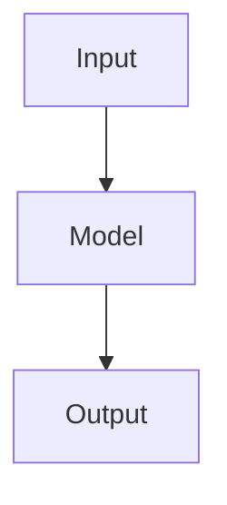

# 项目文档（docs）统一规范

## 1. 文档体系目标

本目录用于维护项目全生命周期文档，包括：

- 项目背景与目标
- 技术架构
- 设计决策
- 开发规范
- 数据与实验记录
- 部署运维
- AI辅助研发上下文

文档目标：

1. 保证项目知识长期沉淀，避免关键设计依赖个人记忆；
2. 降低新成员理解项目的成本；
3. 支持多人协作开发；
4. 支持 AI 编程助手（Claude、ChatGPT、Codex 等）快速理解项目上下文；
5. 保证实验、代码、模型具有可追溯性。


---

# 2. 推荐目录结构

```
docs/
│
├── README.md                 # 文档体系说明（当前文件）
│
├── project/                  # 项目核心认知文档
│   ├── context.md            # 项目背景与整体介绍
│   ├── architecture.md       # 系统/算法架构说明
│   ├── decisions.md          # 关键技术决策记录
│   ├── current_state.md      # 当前项目状态
│   ├── roadmap.md            # 项目规划路线
│   ├── glossary.md           # 专业术语说明
│   ├── ai_prompt.md          # AI协作规范
│   └── knowledge.md          # 长期经验与知识沉淀
│
├── research/                 # 科研相关文档
│   ├── literature.md         # 文献调研
│   ├── hypotheses.md         # 科学问题与研究假设
│   ├── methods.md            # 方法设计
│   ├── experiments.md        # 实验记录
│   └── papers/               # 论文资料
│
├── skills/                   # 可复用技术能力说明
│   ├── meteorology.md        # 气象领域知识规范
│   ├── satellite.md          # 卫星数据处理规范
│   ├── radar.md              # 雷达数据处理规范
│   ├── pytorch.md            # 深度学习开发规范
│   └── deployment.md         # 部署相关规范
│
├── ai/                       # AI工具使用说明
│   ├── claude.md             # Claude使用规范
│   ├── chatgpt.md            # ChatGPT使用规范
│   ├── codex.md              # Codex使用规范
│   └── workflow.md           # AI协作流程
│
├── dev/                      # 开发文档
│   ├── coding_style.md       # 编码规范
│   ├── environment.md        # 环境配置
│   └── debugging.md          # Debug记录
│
├── training/                 # 模型训练相关
│   ├── dataset.md            # 数据集说明
│   ├── training_config.md    # 训练配置
│   ├── experiments.md        # 训练实验记录
│   └── evaluation.md         # 评价指标
│
├── deploy/                   # 部署文档
│   ├── deployment.md         # 部署流程
│   └── service.md            # 服务说明
│
├── ops/                      # 运维文档
│   ├── operation.md          # 日常运行维护
│   └── troubleshooting.md    # 常见问题
│
└── figs/                     # 文档图片
```

---

# 3. 文档书写基本要求

## 3.1 通用原则

所有文档遵循：

### 1. 面向未来阅读

文档不是记录聊天过程，而是记录最终有效信息。

不要：

```
昨天讨论了一下，觉得方案A可能比较好。
```

应该：

```
采用方案A。

原因：
方案A在当前数据条件下具有更好的稳定性。
```

---

### 2. 记录结论，不记录过程

错误：

```
尝试了方法A，然后失败，又尝试方法B。
```

正确：

```
方法A由于XXX原因不适用，目前采用方法B。
```

---

### 3. 保持可追溯

重要修改必须包含：

- 日期
- 修改人
- 修改原因
- 影响范围


---

# 4. project目录规范

## 4.1 context.md

### 目的

描述项目是什么，让新成员或AI快速理解项目。


### 必须包含

```markdown
# 项目名称


## 项目简介

说明：
- 项目目标
- 应用场景
- 解决的问题


## 技术背景

说明：
- 领域背景
- 核心技术


## 输入数据

说明：
- 数据来源
- 数据格式
- 数据规模


## 输出结果

说明：
- 系统输出
- 模型输出


## 技术栈

例如：

Python
PyTorch
Docker
XXX


## 项目约束

说明：
- 不可改变的接口
- 数据限制
- 工程限制
```

---

## 4.2 architecture.md

### 目的

描述系统整体结构。


### 内容要求

包括：

- 系统模块划分
- 数据流
- 模型流程
- 模块之间关系


推荐：

使用 Mermaid：




---

## 4.3 decisions.md

### 目的

记录关键技术决策。


### 格式

每个决策必须编号：

```
DEC-001
DEC-002
```


模板：

```markdown
# DEC-001 标题


## 日期

YYYY-MM-DD


## 背景

为什么需要做这个决策？


## 决策内容

最终采用方案。


## 备选方案

其他考虑过的方法。


## 原因

为什么选择当前方案。


## 影响

对后续开发的影响。
```

---

## 4.4 current_state.md

### 目的

记录项目当前状态。


必须包含：

```markdown
# 当前版本


## 已完成

-


## 当前实现

说明当前代码状态。


## 当前问题

-


## 下一步计划

-
```

要求：

每次重要开发完成后更新。

---

## 4.5 roadmap.md

### 目的

记录未来规划。


格式：

```markdown
# Roadmap


## Phase 1

目标：

任务：


## Phase 2

目标：

任务：
```

---

## 4.6 glossary.md

### 目的

统一专业术语。


格式：

```markdown
## CI

全称：

Convective Initiation


说明：

XXX
```

---

## 4.7 ai_prompt.md

### 目的

指导AI参与项目开发。


必须包含：

```markdown
# AI角色

说明AI负责什么。


# 修改原则

例如：

- 优先最小修改
- 不改变已有接口
- 修改前说明影响


# 项目特殊约束

说明：

- 技术限制
- 业务要求
- 科学约束
```

---

## 4.8 knowledge.md

### 目的

沉淀长期经验。


记录：

- 已验证规律
- 常见问题
- 技术经验
- 避坑记录


例如：

```
不要直接修改XXX参数。

原因：

会导致XXX问题。
```

---

# 5. research目录规范

## 5.1 literature.md

记录文献调研。


必须包含：

|字段|说明|
|-|-|
|论文名称|完整标题|
|作者|作者列表|
|年份|发表年份|
|来源|期刊/会议|
|DOI|唯一标识|
|核心贡献|主要发现|
|项目关联|与当前项目关系|

---

## 5.2 hypotheses.md

记录科学问题。


格式：

```markdown
# 科学问题


## 问题描述


## 当前认识


## 假设


## 验证方法
```

---

## 5.3 methods.md

描述研究方法。


包括：

- 方法原理
- 输入输出
- 算法流程
- 参数设置


---

## 5.4 experiments.md

实验必须记录：


```markdown
# EXP-001


日期：

实验目的：

数据：

方法：

参数：

结果：

结论：

下一步：

复现教程: 这里写实现的项目地址及运行代码步骤的文档地址
```

禁止只保存最终指标，不记录实验条件。

---

# 6. skills目录规范

## 目的

沉淀团队可复用能力。


例如：

- 数据处理流程
- 模型训练经验
- 领域知识


要求：

不要绑定单个项目。

内容应该可以复用于其他项目。

---

# 7. ai目录规范

## 目的

记录不同AI工具使用方式。


例如：

### Claude

适合：

- 大规模代码阅读
- 多文件修改


### ChatGPT

适合：

- 技术方案设计
- 科研分析


### Codex

适合：

- Repo级开发
- 自动测试


---

# 8. 更新规范

## 代码修改

涉及以下内容必须更新：

- 架构变化 → architecture.md
- 技术方案变化 → decisions.md
- 当前状态变化 → current_state.md
- 新经验 → knowledge.md


## 实验

新增实验必须更新：

- research/experiments.md


## 发布版本

更新：

- changelog.md（如有）


---

# 9. AI协作推荐流程

任何AI参与项目时：

阅读顺序：

```
1. docs/project/context.md

2. docs/project/current_state.md

3. docs/project/decisions.md

4. docs/project/architecture.md

5. docs/research/
```

修改代码前：

必须确认：

1. 当前设计约束；
2. 已存在技术决策；
3. 是否会影响已有实验结果。


---

# 10. 文档维护原则

项目文档不是附属材料，而是项目长期资产。

代码会迭代，模型会更换，人员会流动，但：

- 技术决策
- 科学认识
- 工程经验

必须通过文档持续积累。
