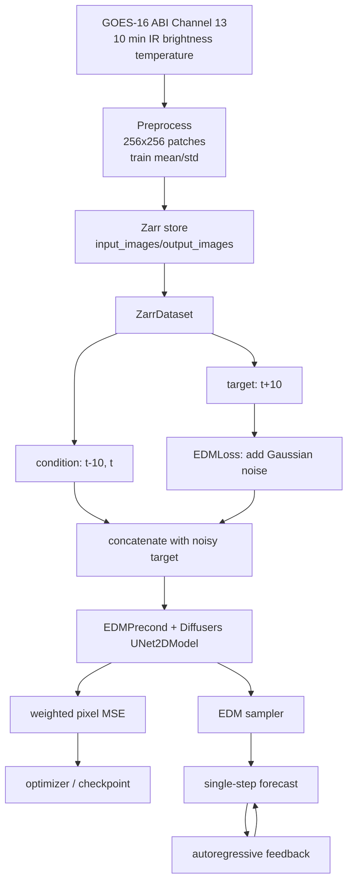

# CIRA-Diff baseline 架构

## 模块划分

1. 数据：Zarr store → `ZarrDataset` → PyTorch `DataLoader`。
2. 条件输入：过去两帧卫星红外亮温图像。
3. 生成目标：训练集为下一时刻亮温图像；validation/test 额外保存 18 帧真实未来序列用于 rollout 评估；CorrDiff 变体的目标是普通 U-Net 预测与真值之间的残差。
4. 网络：Diffusers `UNet2DModel`，外层包装为 `EDMPrecond`。
5. 训练：随机采样 EDM 噪声等级，加噪后将 noisy target 与 condition 沿 channel 维拼接，使用加权 MSE 反向传播。
6. 采样：EDM sampler 使用 18 个 noise steps，Euler 更新加二阶校正；可改变随机种子生成 ensemble。
7. rollout：单步预测结果回填到历史窗口，重复 18 次得到 3 h 预测；validation/test 的 `output_images` 提供对应的 18 帧 truth，不是模型生成结果。

## 数据流



## 代码对应关系

| 功能 | 当前实现 | 备注 |
|---|---|---|
| 数据读取 | `cira_diff/dataset.py:ZarrDataset` | 一次性加载两个数组到 CPU，返回 target、condition |
| EDM 包装 | `cira_diff/edm.py:EDMPrecond` | 只对 generation channels 做 EDM scaling，condition 原样拼接 |
| EDM loss | `cira_diff/edm.py:EDMLoss` | 采样 log-normal sigma 并计算加权平方误差 |
| EDM sampling | `cira_diff/edm.py:edm_sampler` | 默认 `num_steps=18`，Euler + 二阶校正 |
| 训练循环 | `scripts/Chase_2025/train_edm_Chase2025.py` | 当前可追溯的完整脚本入口 |
| CorrDiff 训练 | `scripts/Chase_2025/train_edm_CorrDiff_Chase2025.py` | condition channel 数为 3，生成 residual |
| 推理/rollout | 未形成独立入口 | `[ISSUE]` 后续需从 notebook 与论文重建并测试 |

## 训练与评估数据流差异

```text
train ordinary:  input[2 frames] -> target[1 frame]
train CorrDiff:  input[3 channels] -> residual[1 frame]
validation/test: input[2 frames] -> truth[18 future frames]
```

[FACT] 这解释了为什么“Dataset sample 是三帧”只适用于普通 train 的单步样本，而不能推广到 validation/test 或原始 GOES 数据。

## 当前边界

[FACT] 当前仓库实现的是单步条件扩散训练与采样组件。

[UNKNOWN] 当前仓库是否完整重现论文中的所有数据生成、验证集超参选择和批量评估流程，尚未由本项目实验确认。
