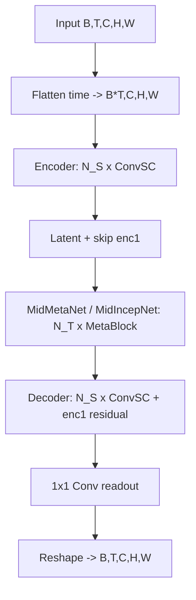

# 系统 / 算法架构

## 模块划分（OpenSTL 三层抽象）

OpenSTL 将 STL 算法拆为三层，从底向上：

- `openstl/modules/`：网络算子与基础层（如 `ConvSC`、`GASubBlock`、`TAUSubBlock` 等）。
- `openstl/models/`：完整网络架构（如 `SimVP_Model`）。
- `openstl/methods/`：训练 / 预测逻辑（如 `SimVP`，继承 `Base_method`）。
- `openstl/api/`：实验运行器（`BaseExperiment`，基于 PyTorch Lightning）。
- `tools/train.py`、`tools/test.py`：可执行训练 / 测试入口。
- `openstl/datasets/dataloader_goes13.py`：EDM GOES-16 ABI ch13 数据 adapter（新增，
  见 `docs/data/`）。通过 `BaseExperiment(dataloaders=...)` 注入，**不改动上游注册逻辑**
  （见 DEC-003）。

## 模型流程（SimVP）

## 数据流

- `get_dataset(dataname, config)` → `BaseDataModule(train/vali/test loader)`。
- `BaseExperiment` 实例化 `method_maps['simvp']`（`SimVP`），绑定 `test_mean` / `test_std`。
- 训练：`training_step` 用 `MSELoss` 监督直接多帧预测。
- 推理：`SimVP.forward` 支持 `aft==pre` / `aft<pre` / `aft>pre`（递归自回归）。

## 模块关系

- `SimVP_Model` 组合 `Encoder` + `MidMetaNet`/`MidIncepNet` + `Decoder`。
- `MetaBlock` 按 `model_type` 选择 `modules` 中的 `XxxSubBlock`。
- `SimVP` method 调用 `SimVP_Model`，并由 `BaseExperiment` 驱动 Lightning 训练循环。
